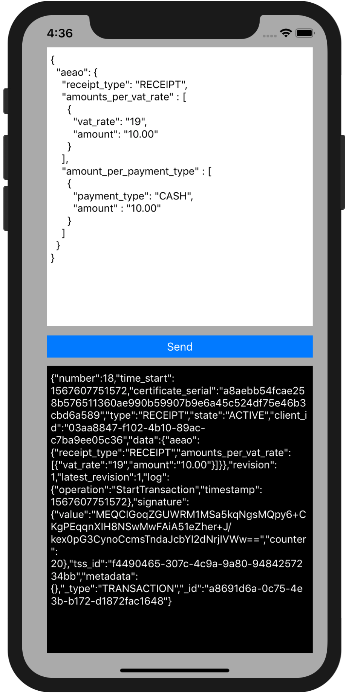

# FiskalyKassenSichvExample for iOS

## What is this about?

This is a small (proof-of-concept) example, that demonstrates the how the client-side executed, pre-compiled, shared SMA library (contained in `FiskalyKassensichvSma.framework`) provided by fiskaly GmbH can be integrated into an Objective-C or Swift iOS app.

This **is not** a feature-complete iOS client library! Instead it should give you a rough idea 
- how we envision the integration of the SMA component on iOS devices, 
- how the communiction between the PoS software and the SMA (i.e. via a JSON-RPC 2.0 based protocol) works 
- and how the SMA is used to intercept and sign transaction-related requests.

This **should be** the starting point for developing a reusable Swift or Objective-C based client that will eventually be hosted on https://github.com/fiskaly/fiskaly-kassensichv-client-ios, similar to clients for other languages and runtimes (e.g. https://github.com/fiskaly/fiskaly-kassensichv-client-node).

## How to get this example running?

1. go to https://dashboard.fiskaly.com, create an account and generate some test data and an API key + secret
2. `open FiskalyKassensichvExample.xcodeproj`
3. navigate to `ViewController.swift`, search for `//TODO` comments and insert appropriate values for `tssId`, `clientId`, `apiKey` and `apiSecret`
4. build and run the project on any iOS device or simulator (⌘B ⌘R)
5. the app should now be running
6. every click on the `Send` button will start a new transaction with the process data provided in the first text field
7. the lower text field will contain the response body of the start transaction request from the API

